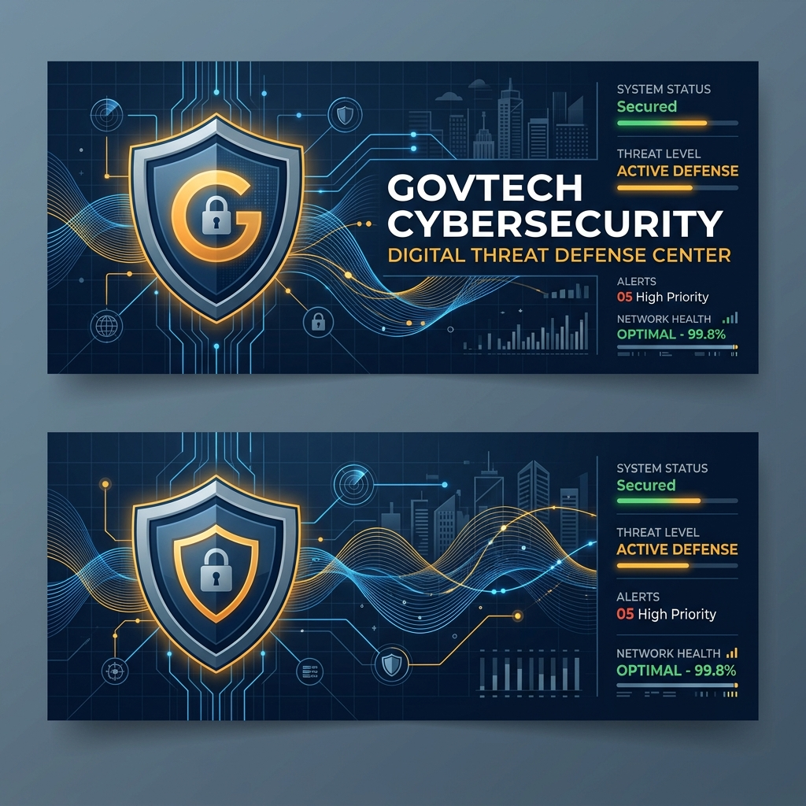

# PROJECT REPORT: KAWACH AI (Digital Public Safety Command Portal)

**Team Name**: [Insert Team Name]  
**Submission Category**: AI for Digital Public Safety  
**GitHub Repository**: [AI-for-Digital-Public-Safety-Defeating-Counterfeiting-Fraud-Digital-Arrest-Scams](https://github.com/shaikrajiummar/AI-for-Digital-Public-Safety-Defeating-Counterfeiting-Fraud-Digital-Arrest-Scams)

---

## 1. Executive Summary
Kawach AI is an integrated, enterprise-grade public safety dashboard designed to address three major vectors of digital fraud in India:
1.  **Digital Arrest Scams**: VoIP impersonation scams pretending to be from official agencies (CBI, Customs, Police).
2.  **Money Laundering & Mule Account Networks**: Coordinated transaction routing designed to siphon off scammed savings.
3.  **Fake Indian Currency Notes (FICN)**: Distribution of high-quality counterfeit notes through regional corridors.

The prototype implements a trust-focused, light-theme GovTech SaaS design utilizing the browser's native capabilities to simulate complex forensics, including speech audio tap playbacks, cell tower signal triangulation, multi-spectral ink absorption tests, and blockchain case logging.

---

## 2. Problem Statement Analysis

| Cybercrime Vector | Traditional Detection Hurdles | Kawach AI Disruptive Solution |
| :--- | :--- | :--- |
| **Digital Arrests** | Victims are isolated on private video calls, pressured into silence, and forced to transfer assets. | Real-time transcript scanning, AI voice cloning detection, and immediate cell tower triangulation to locate SIM boxes. |
| **Money Mules** | Funds are split across dozens of banks within minutes, preventing recovery. | Linked Syndicate Graphs highlighting siphoning paths to coordinate bank freezes. |
| **FICN (Fake Currency)** | Tellers rely on visual checks which fail to flag high-quality offset print counterfeits. | Multi-spectral scanning bed simulating UV, Infrared (IR) ink absorption, and Magnetic (MG) resonance sweeps. |

---

## 3. System Architecture & Modules

The application is structured as a client-side single page application (SPA) optimized for zero-latency local execution:

```
kawach-ai/
├── public/
│   ├── favicon.svg          # GovTech Seal Logo
│   └── icons.svg            # System Graphics
├── src/
│   ├── assets/              # Static Icons
│   ├── components/
│   │   ├── Dashboard.jsx            # Commmand Center & Block Ledger
│   │   ├── ArrestScamDetector.jsx   # Transcript Scanner & GPS Triangulation
│   │   ├── CurrencyNoteScanner.jsx  # Multi-Spectral Banknote Bed
│   │   ├── FraudNetworkGraph.jsx    # Syndicate Linkage Drag-and-Drop Canvas
│   │   └── CitizenFraudShield.jsx   # WhatsApp Multi-lingual Diagnostic Bot
│   ├── data/
│   │   └── mockData.js              # Centralized scenarios and translation database
│   ├── App.jsx              # Tab routing, persona controls, and marquee alerts
│   ├── index.css            # Custom CSS styling tokens
│   └── main.jsx             # React Bootstrap loader
├── tailwind.config.js       # Gov-theme navy/saffron palette configurations
└── package.json             # React 19 dependencies & scripts
```

---

## 4. Feature Walkthrough & Technical Implementations

### A. Threat Command Center (Dashboard)
*   **Geospatial Radar**: Plots coordinates of cybercrime hubs onto an SVG grid container of India. Shows live tower grids and monthly caseload gauges.
*   **MHA Blockchain Audit Registry**: Generates cryptographic SHA-256 signatures in the background as NCRB case alerts are filed, validating evidence authenticity under Sec 65B of the Indian Evidence Act.
*   **Live Base Geolocation**: Connects to the browser Geolocation API to identify the investigator's local coordinate node on the dashboard.

### B. Digital Arrest Audio Analyzer
*   **Voice Tap Intercept ("Hear the Calls")**: Utilizes the native browser `window.speechSynthesis` API. When played, the browser reads transcripts aloud, alternating pitch registers to represent the scammer and the victim.
*   **VoIP tower Triangulator HUD**: Draws concentric geometric circles overlapping suspect tower coordinates, updating latitudes/longitudes in real-time as coordinates drift.
*   **AI Deepfake Detector**: Audits speech tracks for synthetic vocoder distortions and room-reverberation absence.

### C. Multi-Spectral Currency Verifier
*   **UV Light Scan**: Glows fluorescent security thread segments and scattered security fibers.
*   **Infrared (IR) Scan**: Simulates night-vision ink checks. Genuine notes hide the left-half print under IR; counterfeits remain fully visible.
*   **Magnetic (MG) Sweep**: Sweeps note with a sensor head and renders an animated resonance waveform curve. Genuine notes peak at the security thread and serial numbers; fakes show a flatline.

### D. Syndicate Linkage Graph
*   **Drag-and-Drop Nodes**: Interactive SVG representation of transactions linking fraudsters, devices, and mule banks.
*   **Force Cluster Layout**: Runs a spring mathematical layout to cluster nodes by relationship proximity.

### E. Citizen Safety Shield Chatbot
*   **Multi-Lingual Diagnostics**: Guided chat flow translated instantly across English, Hindi, Tamil, Telugu, and Bengali.
*   **NCRB Draft Generator**: Compiles chat responses into a formal FIR template with copy-to-clipboard options.

---

## 5. Technology Stack & Packages

*   **React 19**: Core reactivity and component architecture.
*   **Vite 8**: Rapid production compilation and hot-reloading development server.
*   **Tailwind CSS v3**: Clean light-theme GovTech styling palette.
*   **Recharts v3**: Area charts and Bar graphs tracking case counts.
*   **Lucide React**: Clean iconography.

---

## 6. Code Quality & Compilation Verification Logs

### A. Production Build Verification (`npm run build`)
The production bundle compiles cleanly with Vite:
```bash
vite v8.1.5 building client environment for production...
transforming...✓ 2356 modules transformed.
rendering chunks...
computing gzip size...
dist/index.html                   1.40 kB │ gzip:   0.71 kB
dist/assets/index-CYQdW-M8.css   33.21 kB │ gzip:   7.16 kB
dist/assets/index-CCnOW3ZN.js   671.19 kB │ gzip: 195.55 kB
✓ built in 3.21s
```

### B. Linter Audit Cleanliness (`npm run lint`)
The codebase was validated using `oxlint` (Oxc linter), verifying zero react-hooks warnings and zero dead variables:
```bash
Found 0 warnings and 0 errors.
Finished in 22ms on 11 files with 91 rules using 16 threads.
```
